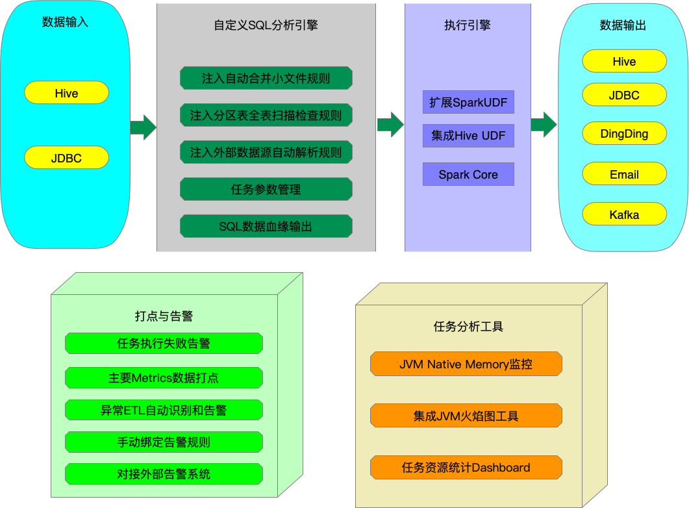

sql_runner 是一个以Spark SQL为内核，以SQL为主体，扩展支持了数据质量告警，支持多种外部数据源，支持数据处理流程控制的数据处理引擎。



用户通过sql_runner命令就可以执行一个包含各种扩展SQL的sql任务。
运行命令:`sql_runner [job_file.sql]` 

# Quick Start

编写SQL文件:

```sql
/************************************************

  author: kun.wan
  period: day
  run_env: PRD
  describe: 基础数据处理脚本

************************************************/

INSERT  OVERWRITE TABLE trade.dws_trade partition(dt='${date|yyyyMMdd}')
SELECT  *
FROM    trade.dwd_trade t
WHERE   t.dt = '${date|yyyyMMdd}';
```

通过`sql_runner [job_file]` 命令就可以实现将表`trade.dwd_trade`的数据清洗到表`trade.dws_trade`。

运行说明:
* 程序的第一部分为任务注释，注释中必须要包含 `author`, `period`, `run_env`, `describe` 这几个字段，主要是基于大型项目中的任务管理考虑，在之后的一些Demo中会将这部分头注释做省略。
* 第二部分是我们需要运行的SQL命令，后面对系统当前支持的命令再详细介绍。
* 在SQL中有看到`${date|yyyyMMdd}` 这样的特殊参数，这个会参考系统的参数管理章节。

# 系统命令

当前系统支持如下命令
* 单行注释命令
* 多行注释命令
* SET参数命令
* IF命令
* SQL命令

## 单行注释命令

以`--` 作为单行注释开始，系统执行的时候会忽略单行注释

## 多行注释命令

以`/**` 作为多行注释开始，以 `*/`作为多行注释结束，系统执行的时候会忽略多行注释

## SET参数命令

以`!set` 作为SET命令开始，以`;` 作为命令结束符, 命令格式: `!set [key]=[value];`, 系统执行的时候解析该参数为系统参数

## IF命令

以`!if` 作为IF命令开始，以`!fi`作为命令结束符，命令支持`!else`语句分支，命令格式:
```
!if ([条件判断语句])
  [命令1]
  [命令2]
  [命令3]
!else
  [命令4]
  [命令5]
!fi
```
命令正在执行的时候会对上述条件判断语句进行判断，如果条件为真，执行IF下面的命令，如果条件为假，执行ELSE下面的命令。

使用示例1: 对运行环境参数进行判断，来选择IF分支命令的选择执行

```sql
!set user = "kun.wan";
!if (user = 'kun.wan')
  select 'if command';
!else
  select 'else command';
!fi
```

使用示例2: 根据之前的SQL执行结果进行判断，来选择IF分支命令的选择执行

```sql
SELECT /*+ COLLECT_VALUE('row_count', 'c') */ count(1) as c;
SELECT /*+ COLLECT_VALUE('row_count2', 'd') */ count(1) as d;

!if (row_count = row_count2 and row_count = 1)
  select 'row count is 1';
!else
  select 'row count is not 1';
!fi
```

## SQL命令

除去以上命令，其他的代码会被解析为SQL命令，以`;` 作为命令结束符；每个SQL会由SQL引擎解析执行


# 参数管理

系统执行过程中会有很多运行以来参数，包括时间参数， 系统参数和Set命令参数。
系统通过set命令，apollo配置等方式进行参数定义，在程序中使用`${variable}`的格式引用参数。
通过 `${variable, 'DEFAULT_VALUE'}`格式引用参数时，如果没有找到`variable`参数，则返回`DEFAULT_VALUE`

## 时间参数

时间参数是一个特殊类型的参数，表示任务运行的批次时间，如没有其他参数影响，系统时间由如下决定:

* 如果是`period=month`, 系统时间表示当前时间的上一个月的1日0点0分0秒
* 如果是`period=day`, 系统时间表示当前时间的前一天的0点0分0秒
* 如果是`period=hour`, 系统时间表示当前时间的上一个小时的的0分0秒

说明:
* 时间参数以date 开头，date表示当前job的运行批次时间。
* 时间可以通过`+`和`-`来进行时间的加减运行
* 在做时间运算的时候以数字和时间单位表示加减的时间窗口，时间单位中，Y表示年，M表示月， D表示天，H表示小时，m表示分钟，S表示秒。
* 输出的时间格式默认为 `yyyyMMdd`，可以通过 `|` 后连接自定义的时间格式来自定义输出时间格式。时间格式为Java 默认的时间解析格式。

示例: `${date-3d|yyyyMMdd}`

## 系统参数

为了方便程序运行，程序启动的时候已经设置了一些系统参数，用于辅助程序运行。

## 系统环境参数

系统启动的时候会读取`env.xml` 中的配置作为系统参数，另外一些数据库中的配置系统会从Apollo中进行获取。

另外系统还支持在命令行中修改一些系统参数:
* --dates : 手工指定系统的运行批次时间，后面可以添加多个日期参数，通过逗号分隔。每个日期参数格式：`--dates 2021-01-01T00:00:00,2021-01-03T00:00:00`
* --dateRange : 手工指定系统的运行批次时间，后续跟批量运行的开始日期和结束日志，参数格式:`--dateRange 2021-01-01T00:00:00 2021-01-03T00:00:00`, 默认会每一个时间单位（天级任务就是一天，小时任务就是一小时）运行一次，可以通过 `--dateRangeStep` 参数修改多少个时间单位运行一次。
* --test : 单次执行该任务，此时任务会把执行日志屏幕输出；如果程序运行错误，不会进行告警。在开发模式和补跑数据时可以添加该参数运行。
* --dryrun : 空跑模式， 此模式会空跑指定任务中的SQL，并在屏幕上输出日志，可用于检查编写的程序正确性。

## Set命令参数

这个是在任务运行过程中修改系统参数

# 参数的使用

对于上说的各种参数，可以通过`${variable}`格式，在SQL中引用，系统在执行的时候会自动进行参数替换。
此外，参数还支持嵌套参数引用，即 `${variable1 ${variable2 ${variable3}} }`

# 高级功能说明

* [外部数据源的读写](docs/External_Sources.md)
* [数据质量告警](./docs/Data_Check.md)
* [Hive表数据写入时排序索引](./docs/Index_Column.md)
* [Trouble Shooting](./docs/Trouble_Shooting.md)
* [UDF函数](./docs/UDF.md)

# 日志管理

* 如果程序在开发环境运行，需要传入参数 `--test`，程序日志直接在命令行输出；如果程序运行出错，不进行告警；
* 如果程序在生产环境运行，程序运行日志输出在目录下 `/tmp/{USER}/${yyyyMMdd}`，程序运行完毕后会将日志归档到HDFS目录 `/metadata/logs/insight/${yyyyMMdd}`；如果程序运行出错，自动进行钉钉告警；

# Contributing

开启本地调试模式

* 注释掉pom中的 `hive-cli` 和 `hive-exec`两个依赖的provide依赖
* 在resource目录下补充hdfs，yarn，hive的访问配置文件
* 启动 `org.apache.sql.runner.JobRunner` 程序
