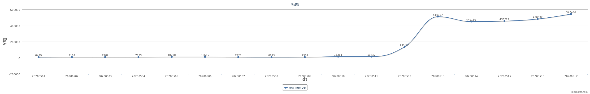
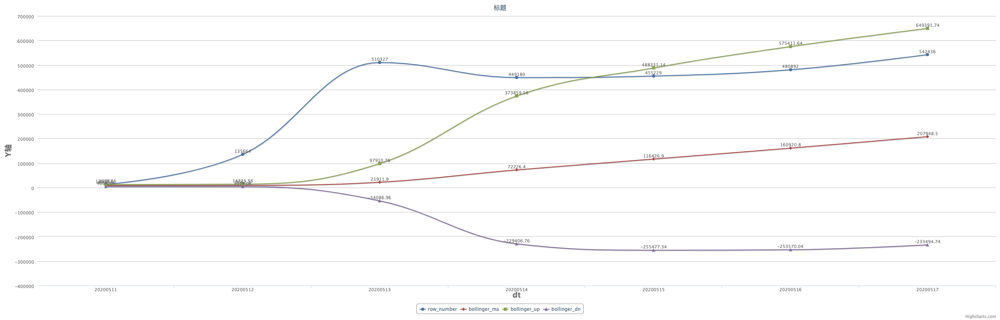
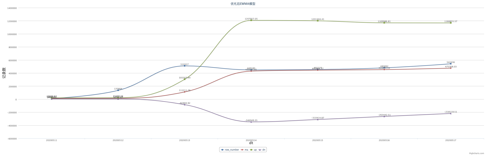
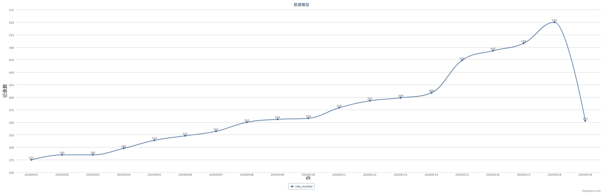
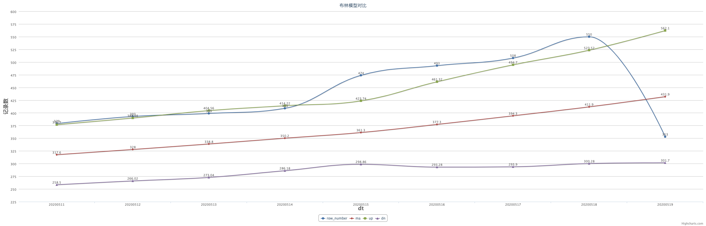
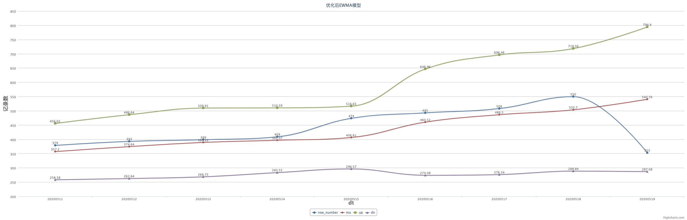

# Spark分区数据质量检查

本系统扩展了Spark的ExternalCatalogEventListener类，增加了对分区表在进行分区变化时的监听。
对监听到发生变化的分区进行进行表分析。
获取当前表中的其他历史分区的记录条数，建立记录数预估模型，如果当前分区的记录数不在预估模型内，则进行告警。

目前数据预估模型有两类：布林模型(Bollinger)和指数加权移动平均模型(EWMA)

## 布林模型(Bollinger)

MA=最近10天记录数的绝对平均值
MD=最近10天记录数的标准差
(MA, UP, DN) = (MA, MA + 2 * MD, MA - 2 * MD)

## 指数加权移动平均模型(EWMA)

MA=最近10天记录数的指数加权移动平均值
MD=最近10天记录数和当日MA的标准差
(MA, UP, DN) = (MA, MA + 2 * MD, MA - 2 * MD)

## 模型对比

### 数据对比模型1

表的记录数

Bollinger模型效果

EWMA模型效果

### 数据对比模型2

表的记录数

Bollinger模型效果

EWMA模型效果
